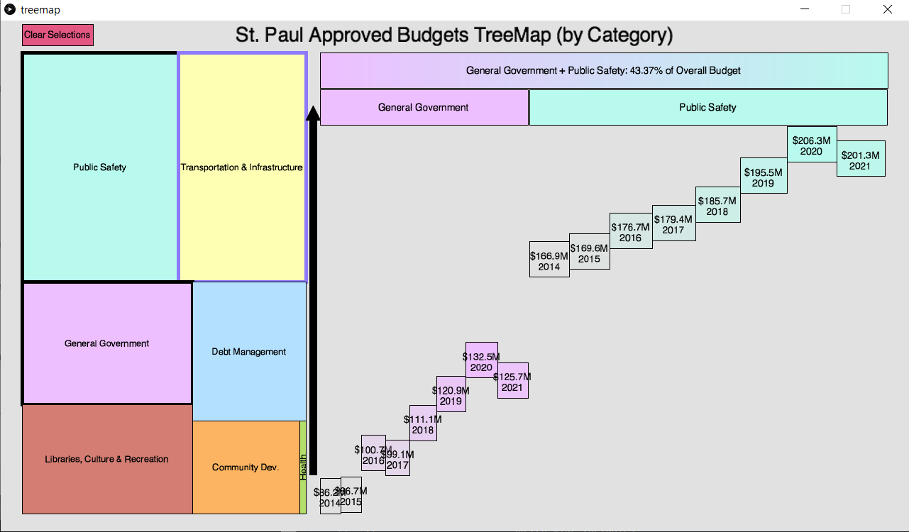

# St-Paul-Budget-Data
Visualization of the city of St. Paul (capital of Minnesota)'s approved financial budget data from 2014 to 2021. This was part of a multiweek class project for CSCI 5609 (Data Visualization) at the University of Minnesota in Spring 2022. The project was created using the Processing 2D graphics software. <br/>

## Contributors
Hamza Khan (owner of this repo), Zeb Zimmer, Sameer Bhagi. The source code is not available here, just the executable file as well as the dataset (.csv) used.
Part of the support code we built upon was provided by Professor Daniel Keefe and Bridger Herman at the University of Minnesota. <br />

## Usage (Windows x64 only for now)
First clone the repository using ```git clone https://github.com/khan0617/St-Paul-Budget-Data/``` in your terminal <br/>
It might take a little bit to clone everything since the application comes bundled with Java so you don't have to install it separately.
Then, launch the application by double clicking "treemap.exe" </br>

## Data
We obtained data from the [St. Paul Open Budget Data Set](https://www.stpaul.gov/departments/financial-services/saint-pauls-budget#!/year/default). <br/>

## Techniques
We use the technique of 'Overview First, Zoom and Filter, Then Details on Demand' that is known in the data visualization space. <br/>
Three main screens: Treemap (the grid of squares shown on startup, size proportional to value), hover for yearly line-chart breakdown, click for yearly Sankey Diagram esque breakdown




